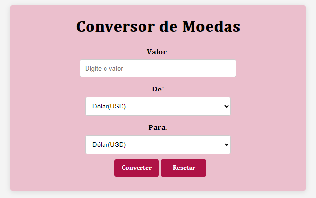

# Conversor de Moedas API

Este projeto é uma evolução do projeto desenvolvido na AVPI, com o objetivo de criar uma aplicação web que permita ao usuário converter valores entre diferentes moedas de forma fácil e precisa. Este conversor utiliza HTML5, CSS3 e JavaScript puro, além de uma API de câmbio para obter taxas de conversão em tempo real.



## Funcionalidades
1. **Entrada de Valor:** O usuário pode inserir um valor na moeda de origem para ser convertido.
2. **Seleção de Moedas:** O usuário pode escolher a moeda de origem e a moeda de destino a partir de uma lista (por exemplo, Dólar, Euro, Real).
3. **Conversão em Tempo Real:** A aplicação consulta uma API de câmbio para obter a taxa de conversão mais recente e realiza a conversão do valor inserido.
4. **Reset:** O formulário possui um botão de "Limpar" para redefinir os campos e permitir uma nova conversão.
5. **Exibição de Resultados:** O valor convertido é exibido diretamente na interface, de forma clara, indicando a moeda de destino.

## Requisitos Técnicos
**HTML5**
- Estruturação da página usando tags semânticas como ``<form>``, ``<input>``, ``<select>``, etc.
- Criação de um formulário para inserir o valor e selecionar as moedas.

**CSS3**
- Estilo minimalista e responsivo, garantindo um design que se adapta a diferentes dispositivos.

**JavaScript**
- Lógica para interação com a API de câmbio e realização da conversão com cotações atualizadas.

#

## Integração com API de Câmbio
O projeto faz uso de uma API de câmbio para obter as taxas de câmbio em tempo real. É necessário cadastrar-se em uma plataforma de API de câmbio, como ExchangeRate-API, Open Exchange Rates ou Fixer.io, para obter uma chave de API.

## Configuração da API
- API de Câmbio: A consulta à API é feita utilizando JavaScript puro, através de requisições HTTP assíncronas com ``fetch()``.
- Chave de API: Cadastre-se na plataforma de sua escolha e obtenha uma chave de API, que será utilizada na aplicação para acessar as taxas de câmbio.

## Como Usar
1. Configuração Inicial:
- Insira sua chave de API no código JavaScript para ativar a funcionalidade de consulta de câmbio.

2. Navegador:
- Abra o arquivo HTML no navegador para executar a aplicação.

3. Conversão:
- Digite o valor desejado, selecione a moeda de origem e a moeda de destino, e clique em "Converter".

4. Resetar:
- Utilize o botão "Resetar" para redefinir os campos e realizar outra conversão.

## Exemplos de Código
### Código Completo JavaScript para Requisição à API

```JavaScript
document.getElementById('currency-form').addEventListener('submit', function(event) {
    event.preventDefault();

    // Obter valores de entrada informados pelo usuário
    const valor = parseFloat(document.getElementById('amount').value);
    const daMoeda = document.getElementById('daMoeda').value;
    const paraMoeda = document.getElementById('paraMoeda').value;

    // Definir taxas de câmbio fixas
    const exchangeRates = {
        USD: { BRL: 5.70, EUR: 0.93 },
        BRL: { USD: 0.18, EUR: 0.16 },
        EUR: { USD: 1.08, BRL: 6.16 }
    };

    // Conversão simples de moedas
    let valorConvertido;
    if(daMoeda === paraMoeda){
        valorConvertido = valor;
    } else {
        valorConvertido = valor * exchangeRates[daMoeda][paraMoeda];
    }

    const conversao = document.getElementById('result');
    conversao.textContent = `Resultado: ${valorConvertido.toFixed(2)} ${paraMoeda}`;
});

// Função para obter valor do campo
const valor = parseFloat(document.getElementById('amount').value);
const daMoeda = document.getElementById('daMoeda').value;
const paraMoeda = document.getElementById('paraMoeda').value;

// Função para obter taxa de câmbio
const exchangeRate = await getExchangeRate(daMoeda, paraMoeda);

if(exchangeRate){
    const convertedValue = valor * exchangeRate;

    console.log(convertedValue);

    const conversao = document.getElementById('conversao');
    conversao.textContent = `RESULTADO: ${convertedValue.toFixed(2)} ${paraMoeda}`;
} else {
    alert('Erro ao buscar a cotação. Tente novamente');
}
```

### Exemplo de HTML para o Formulário
```HTML
<form id="currency-form">
    <label for="amount">Valor:</label>
    <input type="number" id="amount" required>
    
    <label for="daMoeda">De:</label>
    <select id="daMoeda">
        <option value="USD">Dólar</option>
        <option value="EUR">Euro</option>
        <option value="BRL">Real</option>
    </select>

    <label for="paraMoeda">Para:</label>
    <select id="paraMoeda">
        <option value="USD">Dólar</option>
        <option value="EUR">Euro</option>
        <option value="BRL">Real</option>
    </select>

    <button type="submit">Converter</button>
    <button type="reset">Limpar</button>
</form>

<div id="result"></div>

```

## Layout e Design
A interface foi projetada para ser:

- Minimalista e intuitiva, com um layout claro e organizado.
- Responsiva, permitindo uso em diferentes dispositivos.
- De fácil leitura, com cores contrastantes para melhor visibilidade.

### **Autores:**

[Nayra Vitória dos Santos](https://github.com/nayravsantos)

[Leonardo Santiago Sidon da Rocha](https://github.com/leonardossrocha)
